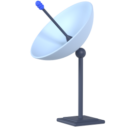

<!-- PROJECT LOGO -->
 

  

  <h3 align="center">Wi-Fi Probe Request De-Randomization</h3>

  

    Network Measurement and Data Analysis Lab
     
    <a>Prof. Alessandro Redondi</a>
     
  

# Lecture

This lecture delves into MAC Address de-randomization within the framework of Wi-Fi Probe Request frames transmitted during the network discovery phase of Wi-Fi devices. The accompanying repository houses notebooks and scripts tailored for the following tasks:

1. **Extraction** of data from `.pcap` format to `.csv`.
2. **Examination** of frame contents to identify pertinent patterns.
3. Implementation of **clustering**, utilizing a toy example to illustrate the significance of discerning crucial features in distinguishing between devices.
4. **Enumeration** of the total devices present in the dataset.
5. **Evaluation** of performance through clustering metrics applied to labeled data.

# Challenges

Implement a better clustering strategy, based on a threshold of equal features between Probe Request Bursts (i.e., sharing $N$% of features). Do **not** use ML models, such as K-Means, DBSCAN, etc.

Then perform MAC Address de-randomization for the devices in `data/challenge-dataset/` at various dataset sizes and for different thresholds of feature equality (e.g., $10, 20, 30, ..., 100$). Analyze the results and observe any patterns or trends in clustering metrics. What can you notice?

Finally, try to perform de-randomization on the unlabelled dataset in `data/unlabelled-challenge.csv`. How many devices are there?

> *Hint:* Observe the clustering metrics for different thresholds and dataset sizes from the first half of the challenge. Apply the insights gained to successfully solve the second half of the challenge.